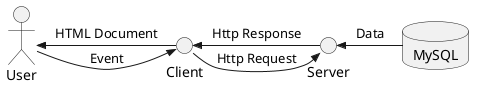
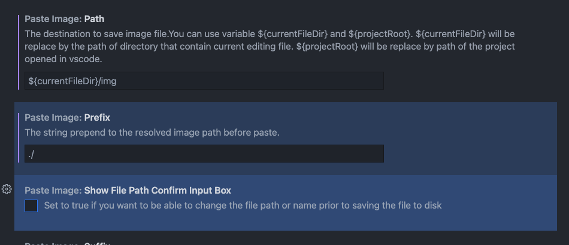

vuepress + github pages 및 action 을 활용하여, 문서 관리하는 방안 정리한 내역.

## Prerequisite
- node.js 및 npm 설치
<https://nodejs.org/ko/>

## Static Site Generator
VuePress로 정적 사이트 생성 환경을 구축했으며, 이를 github page에 배포하여 관리

### VuePress 활용
VuePress 공식 문서 참조
<https://vuepress.vuejs.org/guide/#how-it-works>

#### 1. htdp1.github.io 개발환경 설정 (http://localhost:6400)
```
git clone https://github.com/htdp1/htdp1.github.io.git
npm install
npm run dev
```
#### 2. github page 배포
- local에서 markdown 편집 후 **main** branch에 push
- git hub workflow 자동 실행되어, github page로 배포됨
  - main branch checkout
  - npm build
  - **gh-pages** branch에 build 내역 push
  - **gh-pages** branch에 push된 static resource가 hosting 됨
<https://htdp1.github.io/>

  - <u>*workflow 실행 script 참고*</u>
  <https://github.com/htdp1/htdp1.github.io/blob/main/.github/workflows/main.yml>
```yml
# This is a basic workflow to help you get started with Actions
name: Page Build
# Controls when the action will run. Triggers the workflow on push or pull request
# events but only for the master branch
on:
  push:
    branches: [ main ]
# A workflow run is made up of one or more jobs that can run sequentially or in parallel
jobs:
  # This workflow contains a single job called "build"
  build:
    # The type of runner that the job will run on
    runs-on: ubuntu-latest
    strategy:
      matrix:
        node-version: [14.x]
    steps:
    - name: Checkout
      uses: actions/checkout@main
    - name: Install and Build 🔧 # This example project is built using npm and outputs the result to the 'build' folder. Replace with the commands required to build your project, or remove this step entirely if your site is pre-built.
      run: |
        npm install
        npm run build
    - name: Deploy
      uses: JamesIves/github-pages-deploy-action@releases/v3
      with:
          ACCESS_TOKEN: ${{ secrets.ACCESS_GITHUB_TOKEN }}
          BRANCH: gh-pages # The branch the action should deploy to.
          FOLDER: docs/src/.vuepress/dist # The folder the action should deploy.
```
#### 3. workflow 실행 내역 확인
<https://github.com/htdp1/htdp1.github.io/actions>

<br/>

### PlantUML
간단한 설계 내역 및 프로세스 설명을 위해 plantuml 활용

- plantuml 공식 문서
<https://plantuml.com/ko/>
- config.js extension 적용 내역
```js
  markdown: {
    extendMarkdown: md => {
      md.set({ breaks: true })
      md.use(require('markdown-it-plantuml'))
    }
  }
```

- 사용 예시
```

```


<br/>

### Utterances
Utterances를 적용하여, GitHub Issue를 활용한 댓글 사용 기능 추가

#### 1. htdp1 organization의 댓글이 저장되는 Repository 생성
<https://github.com/htdp1/comment-repository>

#### 2. Utterances 를 htdp1 comment-repository로 설정
<https://github.com/apps/utterances>

#### 3. VuePress에 적용할 template component 생성
<https://github.com/htdp1/htdp1.github.io/blob/main/docs/src/.vuepress/components/Comment.vue>
```js
<template>
  <div ref="comment"></div>
</template>
<script>
export default {
  mounted() {
    // script tag 생성
    const utterances = document.createElement('script');
    utterances.type = 'text/javascript';
    utterances.async = true;
    utterances.crossorigin = 'anonymous';
    utterances.src = 'https://utteranc.es/client.js';
    
    utterances.setAttribute('issue-term', 'pathname'); // pathname|url|title|og:title 중 택 1
    utterances.setAttribute('theme','github-light'); // theme 설정
    utterances.setAttribute('repo',`htdp1/comment-repository`);

    // script tag 삽입
    this.$refs.comment.appendChild(utterances);
  }
}
</script>
```

#### 4. Markdown에서 Comment component 적용
현재는 메뉴의 Introduction page에만 적용되어 있음

```md
##### Comment Test
- comment vue

```

##### Comment Test
- comment vue


### paste image extension


