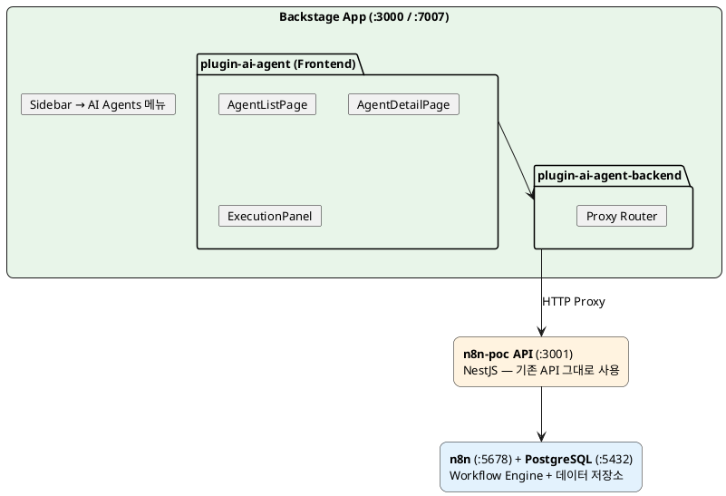
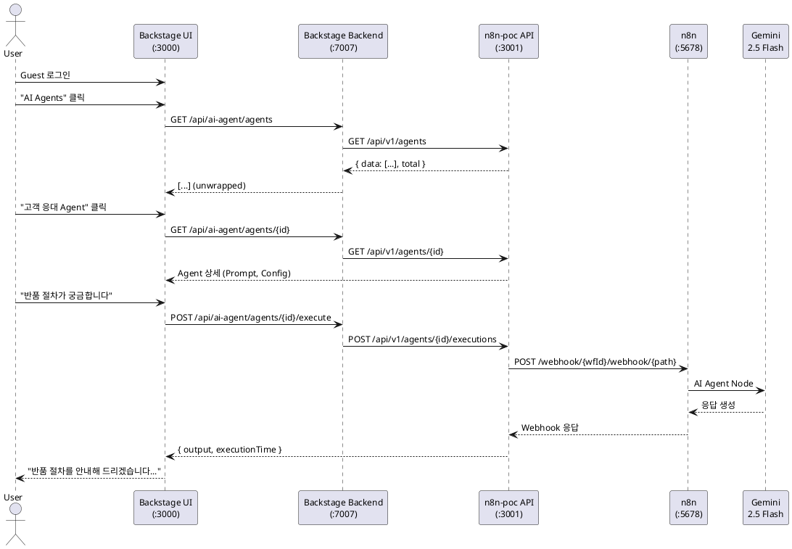

## 왜 Backstage인가

[n8n-poc](/blogs/008_ai_agent/n8n-poc/)에서 만든 AI Agent Builder는 독립적인 애플리케이션이다. 하지만 실제 조직에서 운영하려면 다음 질문이 생긴다:

- Agent를 **누가** 만들었고, **어떤 팀**이 소유하는가?
- 다른 서비스(API, 인프라)와의 **의존 관계**는?
- Agent를 만드는 **표준 절차**가 있는가?

이 질문들은 결국 **Internal Developer Portal (IDP)** 의 영역이다. Backstage는 Spotify가 만든 오픈소스 IDP 플랫폼으로, 다음을 제공한다:

| 기능 | 설명 |
|------|------|
| Software Catalog | 모든 서비스, API, 리소스를 한 곳에서 관리 |
| Plugin System | 기능을 플러그인 단위로 확장 |
| Software Templates | 표준화된 프로젝트 생성 워크플로우 |
| TechDocs | 서비스별 기술 문서 |

핵심 판단: **AI Agent도 조직의 "소프트웨어 자산"이다**. Catalog에 등록하고, 소유권을 추적하고, 표준 절차로 생성할 수 있어야 한다.

---

## 통합 전략

### 설계 원칙

1. **n8n-poc API는 수정하지 않는다** — Backstage는 프록시 + UI 레이어
2. **Backstage 플러그인 표준을 따른다** — New Backend System, Plugin API
3. **최소 변경, 최대 효과** — 기존 코드 재활용, 프록시 패턴

### 아키텍처



### 왜 프록시 패턴인가?

Backstage 백엔드 플러그인이 n8n-poc API에 직접 DB 접근하는 대신 HTTP 프록시를 선택한 이유:

| 항목 | 프록시 (선택) | 직접 DB 접근 |
|------|-------------|-------------|
| n8n-poc 코드 수정 | ❌ 불필요 | ✅ 필요 |
| 독립 배포 | ✅ 각각 배포 가능 | ❌ 결합도 증가 |
| 타입 안전성 | △ (런타임) | ✅ (컴파일타임) |
| 레이턴시 | △ 한 홉 추가 | ✅ 직접 |
| 복잡도 | ✅ 단순 | ❌ ORM 설정 중복 |

PoC 단계에서는 **단순함과 독립성**이 더 중요했다.

---

## Backend Plugin 구현

### 플러그인 정의

Backstage의 New Backend System을 사용한 플러그인 등록. `coreServices`에서 필요한 의존성을 DI로 주입받는다:

```typescript
// plugins/ai-agent-backend/src/plugin.ts

export const aiAgentPlugin = createBackendPlugin({
  pluginId: 'ai-agent',
  register(env) {
    env.registerInit({
      deps: {
        httpAuth: coreServices.httpAuth,
        httpRouter: coreServices.httpRouter,
        logger: coreServices.logger,
        config: coreServices.rootConfig,
      },
      async init({ httpAuth, httpRouter, logger, config }) {
        httpRouter.use(
          await createRouter({ httpAuth, logger, config }),
        );
        // Health 엔드포인트는 인증 없이 접근 허용
        httpRouter.addAuthPolicy({
          path: '/health',
          allow: 'unauthenticated',
        });
      },
    });
  },
});
```

### 프록시 라우터

모든 요청을 n8n-poc API로 전달하는 프록시 패턴. n8n-poc API URL은 `app-config.yaml`에서 설정:

```typescript
// plugins/ai-agent-backend/src/router.ts

export async function createRouter({ httpAuth, logger, config }): Promise<express.Router> {
  const router = Router();
  router.use(express.json());

  const n8nPocBaseUrl = config.getOptionalString('aiAgent.n8nPocApiUrl')
    ?? 'http://localhost:3001';

  // 프록시 헬퍼
  async function proxyFetch(path: string, options?: RequestInit) {
    const url = `${n8nPocBaseUrl}/api/v1${path}`;
    logger.debug(`Proxying to: ${url}`);
    return fetch(url, {
      ...options,
      headers: { 'Content-Type': 'application/json', ...options?.headers },
    });
  }

  // Agent 목록 — upstream은 { data: Agent[], total } 형태
  // Frontend는 배열을 기대하므로 data만 추출 (unwrap)
  router.get('/agents', async (_req, res) => {
    const upstream = await proxyFetch('/agents');
    const json = await upstream.json();
    res.status(upstream.status).json(json.data ?? json);
  });

  // Agent 상세
  router.get('/agents/:id', async (req, res) => {
    const upstream = await proxyFetch(`/agents/${req.params.id}`);
    res.status(upstream.status).json(await upstream.json());
  });

  // Agent 생성
  router.post('/agents', async (req, res) => {
    const upstream = await proxyFetch('/agents', {
      method: 'POST',
      body: JSON.stringify(req.body),
    });
    res.status(upstream.status).json(await upstream.json());
  });

  // Agent 실행 — 핵심 프록시
  router.post('/agents/:id/execute', async (req, res) => {
    const upstream = await proxyFetch(`/agents/${req.params.id}/executions`, {
      method: 'POST',
      body: JSON.stringify(req.body),
    });
    res.status(upstream.status).json(await upstream.json());
  });

  // Health check — n8n-poc API 연결 확인
  router.get('/health', async (_req, res) => {
    try {
      const upstream = await proxyFetch('/n8n/health');
      res.json({ status: 'ok', upstream: await upstream.json() });
    } catch (err) {
      res.status(503).json({ status: 'error', error: String(err) });
    }
  });

  return router;
}
```

:::note[data unwrap]
n8n-poc API는 `{ data: [...], total: N }` 형태로 응답하지만, Backstage Frontend의 `Table` 컴포넌트는 배열을 기대한다. Backend Plugin에서 `data` 필드만 추출하여 이 차이를 해소한다.
:::

### 설정

```yaml
# app-config.yaml
aiAgent:
  n8nPocApiUrl: 'http://localhost:3001'
```

---

## Frontend Plugin 구현

### 플러그인 등록

Backstage Plugin API로 플러그인을 정의하고, API Factory를 통해 `AiAgentClient`를 DI 등록:

```typescript
// plugins/ai-agent/src/plugin.ts

export const aiAgentPlugin = createPlugin({
  id: 'ai-agent',
  apis: [
    createApiFactory({
      api: aiAgentApiRef,
      deps: { discoveryApi: discoveryApiRef, fetchApi: fetchApiRef },
      factory: ({ discoveryApi, fetchApi }) =>
        new AiAgentClient({ discoveryApi, fetchApi }),
    }),
  ],
  routes: { root: rootRouteRef },
});
```

### API Client

`discoveryApi`로 백엔드 URL을 동적 해석하고, `fetchApi`로 인증 토큰이 자동 포함된 요청을 보낸다:

```typescript
// plugins/ai-agent/src/api.ts

export interface Agent {
  id: string;
  name: string;
  description: string;
  status: string;
  modelConfig: {
    provider?: 'gemini' | 'anthropic' | 'openai';
    model: string;
    maxTokens?: number;
    temperature?: number;
  };
  systemPrompt: string;
  createdAt: string;
}

export class AiAgentClient implements AiAgentApi {
  constructor(private options: { discoveryApi: DiscoveryApi; fetchApi: FetchApi }) {}

  private async baseUrl() {
    return this.options.discoveryApi.getBaseUrl('ai-agent');
  }

  async listAgents(): Promise<Agent[]> {
    const url = `${await this.baseUrl()}/agents`;
    const res = await this.options.fetchApi.fetch(url);
    if (!res.ok) throw new Error(`Failed to fetch agents: ${res.statusText}`);
    return res.json();
  }

  async executeAgent(id: string, message: string): Promise<ExecutionResult> {
    const url = `${await this.baseUrl()}/agents/${id}/execute`;
    const res = await this.options.fetchApi.fetch(url, {
      method: 'POST',
      headers: { 'Content-Type': 'application/json' },
      body: JSON.stringify({ message }),
    });
    if (!res.ok) throw new Error(`Failed to execute agent: ${res.statusText}`);
    return res.json();
  }
}
```

### Agent 목록 (AgentListPage)

Backstage의 `Table`, `StatusOK`, `StatusError` 등 공통 컴포넌트를 활용:

```tsx
// plugins/ai-agent/src/components/AgentListPage/AgentList.tsx

const StatusIndicator = ({ status }: { status: string }) => {
  switch (status) {
    case 'active':   return <StatusOK>Active</StatusOK>;
    case 'inactive': return <StatusError>Inactive</StatusError>;
    default:         return <StatusPending>{status}</StatusPending>;
  }
};

const columns: TableColumn<Agent>[] = [
  { title: 'Name', field: 'name' },
  { title: 'Description', field: 'description' },
  {
    title: 'Status',
    render: (row) => <StatusIndicator status={row.status} />,
  },
  {
    title: 'Provider',
    render: (row) => <Chip label={row.modelConfig?.provider || 'N/A'} size="small" />,
  },
  {
    title: 'Model',
    render: (row) => <Chip label={row.modelConfig?.model || 'N/A'} size="small" />,
  },
  {
    title: 'Created',
    render: (row) => new Date(row.createdAt).toLocaleDateString(),
  },
];

export const AgentList = () => {
  const api = useApi(aiAgentApiRef);
  const navigate = useNavigate();
  const { value: agents, loading, error } = useAsync(() => api.listAgents());

  return (
    <Page themeId="tool">
      <Header title="AI Agents">
        <HeaderLabel label="Owner" value="platform-team" />
      </Header>
      <Content>
        <ContentHeader title="Agent List">
          <Button startIcon={<AddIcon />} onClick={() => navigate('new')}>
            Create Agent
          </Button>
        </ContentHeader>
        <Table
          columns={columns}
          data={agents || []}
          isLoading={loading}
          onRowClick={(_e, row) => row && navigate(row.id)}
        />
      </Content>
    </Page>
  );
};
```

### 실행 패널 (ExecutionPanel)

채팅형 UI로 Agent와 대화. `useApi` Hook으로 API Client를 주입받아 사용:

```tsx
// plugins/ai-agent/src/components/ExecutionPanel/index.tsx

export const ExecutionPanel = ({ agentId, agentName }: Props) => {
  const api = useApi(aiAgentApiRef);
  const [input, setInput] = useState('');
  const [messages, setMessages] = useState<ChatMessage[]>([]);
  const [loading, setLoading] = useState(false);

  const handleExecute = async () => {
    if (!input.trim()) return;

    // 사용자 메시지 추가
    setMessages(prev => [...prev, { role: 'user', content: input, timestamp: new Date() }]);
    setInput('');
    setLoading(true);

    try {
      const result = await api.executeAgent(agentId, input);
      const content = typeof result.output === 'string'
        ? result.output
        : result.output?.output ?? JSON.stringify(result.output);

      setMessages(prev => [...prev, {
        role: 'agent',
        content,
        timestamp: new Date(),
        executionTime: result.executionTime,
      }]);
    } catch (err: any) {
      setMessages(prev => [...prev, {
        role: 'agent',
        content: `❌ Error: ${err.message}`,
        timestamp: new Date(),
      }]);
    } finally {
      setLoading(false);
    }
  };

  return (
    <InfoCard title={`Chat with ${agentName}`}>
      {/* 메시지 목록 */}
      <Box style={{ maxHeight: 400, overflow: 'auto' }}>
        {messages.map((msg, i) => (
          <Paper key={i} style={{ padding: 8, margin: 4, ... }}>
            <Typography variant="body2">{msg.content}</Typography>
          </Paper>
        ))}
        {loading && <CircularProgress size={24} />}
      </Box>
      {/* 입력 필드 */}
      <Box style={{ display: 'flex', gap: 8, marginTop: 8 }}>
        <TextField fullWidth value={input} onChange={e => setInput(e.target.value)}
          onKeyPress={e => e.key === 'Enter' && handleExecute()} />
        <Button variant="contained" onClick={handleExecute} disabled={loading}>
          Send
        </Button>
      </Box>
    </InfoCard>
  );
};
```

### Navigation 메뉴

사이드바에 AI Agents 메뉴를 추가:

```tsx
// packages/app/src/components/Root/Root.tsx

import SmartToyIcon from '@material-ui/icons/Memory';

<SidebarItem icon={SmartToyIcon} to="ai-agent" text="AI Agents" />
```

:::note[MUI v4 호환]
Backstage는 Material UI v4를 사용한다. MUI v5의 `gap` prop 대신 `style={{ gap: 8 }}`을 써야 한다. `<Box display="flex" gap={1}>`은 동작하지 않는다.
:::

---

## E2E 검증

Backstage를 통한 전체 파이프라인 검증:



| 검증 항목 | 결과 | 비고 |
|---------|------|------|
| Health Check | ✅ | Backend Plugin ↔ n8n-poc API 연결 확인 |
| Agent 목록 조회 | ✅ | data unwrap 정상 동작 |
| Agent 상세 조회 | ✅ | Prompt, Config 정상 표시 |
| Agent 실행 | ✅ | Gemini 응답 수신 (약 4.5초) |

---

## 기술 스택

| Layer | Technology |
|-------|-----------|
| Backstage | v1.48.0 (New Backend System) |
| Frontend Plugin | React, Material UI v4, @backstage/core-plugin-api |
| Backend Plugin | Express, @backstage/backend-plugin-api |
| n8n-poc API | NestJS, TypeORM, PostgreSQL |
| Workflow Engine | n8n 1.94.1 |
| LLM | Gemini 2.5 Flash |

### 디렉토리 구조

```
backstage-n8n-poc/
├── packages/
│   ├── app/                    # Backstage 프론트엔드
│   └── backend/                # Backstage 백엔드
├── plugins/
│   ├── ai-agent/               # Frontend Plugin
│   │   └── src/
│   │       ├── api.ts          # API 클라이언트 (AiAgentClient)
│   │       ├── plugin.ts       # 플러그인 정의 + API Factory
│   │       ├── routes.ts       # 라우트 정의
│   │       └── components/
│   │           ├── AgentListPage/   # 목록 (Table + Status)
│   │           ├── AgentDetailPage/ # 상세 (Prompt, Config)
│   │           └── ExecutionPanel/  # 채팅 UI
│   └── ai-agent-backend/       # Backend Plugin
│       └── src/
│           ├── plugin.ts       # 플러그인 등록
│           └── router.ts       # 프록시 라우터
└── app-config.yaml             # aiAgent.n8nPocApiUrl 설정
```

---

## 회고

### 잘 된 점

- **프록시 패턴의 효과**: n8n-poc 코드를 한 줄도 수정하지 않고 Backstage에 통합
- **Backstage Plugin System**: 프론트엔드/백엔드 플러그인 구조가 잘 설계되어 있어 확장이 용이
- **New Backend System**: DI 기반으로 깔끔한 플러그인 초기화

### 어려웠던 점

- **Backstage 학습 곡선**: Plugin API, Discovery API, Auth 체계 등 이해해야 할 개념이 많음
- **MUI v4 제약**: 최신 MUI 패턴을 쓸 수 없어 CSS 스타일링에 제한
- **메모리 부담**: Backstage + n8n-poc API + n8n + PostgreSQL 동시 실행 시 7.8GB RAM으로 빠듯함

### 의도적으로 제외한 것

| 항목 | 사유 |
|------|------|
| PostgreSQL 전환 (Backstage DB) | SQLite in-memory로 PoC 충분 |
| Software Template | Agent 생성 표준화는 다음 단계 |
| CatalogProcessor | Agent ↔ Catalog Entity 자동 동기화 |
| RBAC | PoC 범위 밖 |

### 실무 적용 시 고려사항

1. **인증 통합**: Guest 모드 대신 OAuth/OIDC 연동
2. **DB 분리**: Backstage는 별도 PostgreSQL 인스턴스 권장
3. **CatalogProcessor**: Agent를 Catalog Entity로 자동 등록하면 소유권, 의존성 추적 가능
4. **Software Template**: "AI Agent 생성" 템플릿으로 표준화된 생성 워크플로우 제공
5. **모니터링**: 실행 비용, 토큰 사용량 대시보드 추가

---

## 전체 시리즈

1. [n8n 기반 AI Agent Builder 설계와 구현](/blogs/008_ai_agent/n8n-poc/) — 이전 편
2. **Backstage IDP로 AI Agent Builder 통합** — 현재 편

---

> **Source Code**: [github.com/noisonnoiton/backstage-n8n-poc](https://github.com/noisonnoiton/backstage-n8n-poc)
