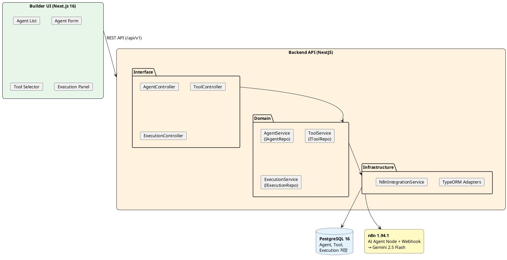
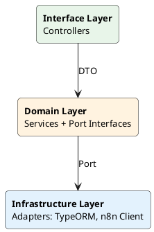
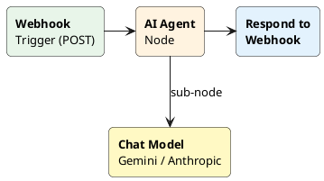
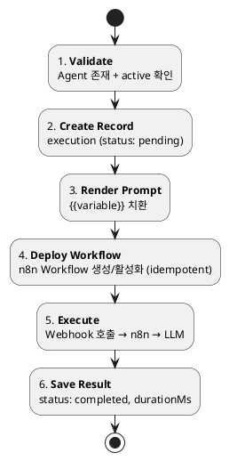
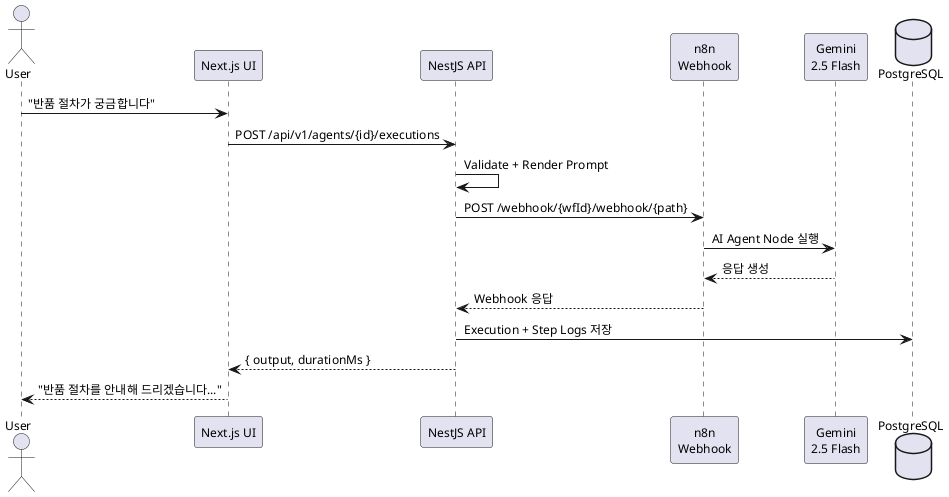

## 왜 만들었나

조직 내에서 LLM 기반 Agent를 활용하려는 수요가 늘고 있지만, 실제로 Agent를 만들고 운영하려면 다음과 같은 장벽이 있다:

- **워크플로우 엔진의 복잡도**: n8n, LangChain 등은 강력하지만 학습 곡선이 높음
- **반복적 보일러플레이트**: Prompt 구성, Tool 연결, 실행 파이프라인이 프로젝트마다 중복
- **운영 가시성 부족**: 실행 이력, 에러 추적, 비용 관리가 체계적이지 않음

이 PoC의 핵심 질문은 단순했다:

> **"n8n을 엔진으로 쓰되, 사용자는 n8n을 몰라도 Agent를 만들고 실행할 수 있을까?"**

---

## 아키텍처

### 전체 구조



### 왜 n8n인가?

| 고려사항 | n8n | LangChain/LangGraph | 자체 구현 |
|---------|-----|---------------------|----------|
| Workflow 시각화 | ✅ 내장 | ❌ | ❌ |
| AI Agent 노드 | ✅ 내장 | ✅ | 직접 구현 |
| Tool 연동 (Slack, HTTP 등) | ✅ 400+ | SDK 기반 | 직접 구현 |
| Self-hosted | ✅ | ✅ | ✅ |
| REST API | ✅ | ❌ | 직접 구현 |
| 학습 곡선 (사용자) | 높음 | 매우 높음 | 낮음 |

n8n을 선택한 핵심 이유는 **REST API로 Workflow를 프로그래밍 방식으로 제어**할 수 있다는 점이다. 사용자에게는 n8n을 노출하지 않으면서, 백엔드에서 n8n API를 통해 Workflow를 자동 생성/배포/실행할 수 있다.

---

## Layered Architecture

Domain-Driven Design의 Layered Architecture 패턴을 적용했다:



### Port 인터페이스 (Domain Layer)

Domain 계층에서 순수 TypeScript 인터페이스로 Repository Port를 정의한다. 프레임워크 의존이 전혀 없다:

```typescript
// domain/agent/agent.interface.ts

export interface IAgent {
  id: string;
  name: string;
  description: string;
  status: AgentStatus;
  systemPrompt: string;
  modelConfig: ModelConfig;
  tools: string[];
  createdAt: Date;
  updatedAt: Date;
}

export interface IAgentRepository {
  findAll(page: number, limit: number, status?: AgentStatus): Promise<{ data: IAgent[]; total: number }>;
  findById(id: string): Promise<IAgent | null>;
  create(agent: Partial<IAgent>): Promise<IAgent>;
  update(id: string, agent: Partial<IAgent>): Promise<IAgent | null>;
  updateTools(id: string, toolIds: string[]): Promise<IAgent | null>;
  delete(id: string): Promise<boolean>;
}

export const AGENT_REPOSITORY = Symbol('AGENT_REPOSITORY');
```

### Service (Domain Layer)

Service는 Port를 통해서만 데이터에 접근한다. `@Inject(AGENT_REPOSITORY)`로 NestJS DI 컨테이너가 Adapter를 주입:

```typescript
// domain/agent/agent.service.ts

@Injectable()
export class AgentService {
  constructor(
    @Inject(AGENT_REPOSITORY)
    private readonly agentRepository: IAgentRepository,
  ) {}

  async findAll(page = 1, limit = 20, status?: AgentStatus) {
    return this.agentRepository.findAll(page, limit, status);
  }

  async create(dto: CreateAgentDto) {
    return this.agentRepository.create({
      name: dto.name,
      description: dto.description,
      systemPrompt: dto.systemPrompt,
      modelConfig: dto.modelConfig,
      tools: dto.tools ?? [],
      status: 'draft',
    });
  }

  async deactivate(id: string) {
    const agent = await this.agentRepository.findById(id);
    if (!agent) return null;
    if (agent.status === 'inactive') {
      throw new BadRequestException('Agent is already inactive');
    }
    return this.agentRepository.update(id, { status: 'inactive' });
  }
}
```

### Entity (Infrastructure Layer)

TypeORM Entity가 Port의 Adapter 역할을 한다. `jsonb` 컬럼으로 ModelConfig를 유연하게 저장:

```typescript
// infrastructure/database/entities/agent.entity.ts

@Entity('agents')
export class AgentEntity {
  @PrimaryGeneratedColumn('uuid')
  id!: string;

  @Column({ length: 255 })
  name!: string;

  @Column({ type: 'varchar', length: 20, default: 'draft' })
  status!: AgentStatus;

  @Column({ type: 'text', default: '' })
  systemPrompt!: string;

  @Column({ type: 'jsonb', default: {} })
  modelConfig!: ModelConfig;

  @ManyToMany(() => ToolEntity, { eager: true })
  @JoinTable({
    name: 'agent_tools',
    joinColumn: { name: 'agent_id' },
    inverseJoinColumn: { name: 'tool_id' },
  })
  toolEntities!: ToolEntity[];

  @Column({ type: 'jsonb', default: [] })
  tools!: string[];

  @CreateDateColumn()
  createdAt!: Date;
}
```

### Module (DI 바인딩)

NestJS Module에서 Port와 Adapter를 바인딩한다:

```typescript
@Module({
  providers: [
    AgentService,
    { provide: AGENT_REPOSITORY, useClass: AgentRepositoryImpl },
  ],
})
export class AgentModule {}
```

---

## 핵심 설계

### Agent 추상화

Agent는 3가지 요소의 조합으로 정의된다:

| 요소 | 설명 | 예시 |
|------|------|------|
| **Prompt** | 시스템 프롬프트 + 변수 템플릿 | `"당신은 {{role}}입니다"` |
| **Tool** | Agent가 사용할 수 있는 도구 | HTTP Request, Slack, Calculator |
| **Config** | 모델 설정 (provider, model, temperature) | Gemini 2.5 Flash, temp=0.7 |

이 추상화의 핵심은 **사용자가 n8n Workflow를 전혀 신경 쓰지 않아도 된다**는 것이다.

### Workflow 자동 생성

Agent를 배포하면, `buildAgentWorkflow()` 함수가 Agent 설정을 n8n Workflow JSON으로 변환한다:



실제 구현에서 LLM Provider에 따라 Chat Model 노드를 동적으로 생성한다:

```typescript
// packages/n8n-client/src/templates/agent-workflow.ts

function buildChatModelNode(input: AgentWorkflowInput): N8nNode {
  if (input.provider === 'anthropic') {
    return {
      name: 'Chat Model',
      type: '@n8n/n8n-nodes-langchain.lmChatAnthropic',
      typeVersion: 1.2,
      parameters: {
        model: input.model || 'claude-sonnet-4-20250514',
        options: {
          temperature: input.temperature ?? 0.7,
          maxTokensToSample: input.maxTokens ?? 4096,
        },
      },
      credentials: {
        anthropicApi: { id: input.credentialId || '', name: 'Anthropic API' },
      },
    };
  }

  // Default: Gemini
  return {
    name: 'Chat Model',
    type: '@n8n/n8n-nodes-langchain.lmChatGoogleGemini',
    typeVersion: 1,
    parameters: {
      modelName: input.model || 'models/gemini-2.5-flash',
      options: {
        temperature: input.temperature ?? 0.7,
        maxOutputTokens: input.maxTokens ?? 2048,
      },
    },
    credentials: {
      googlePalmApi: { id: input.credentialId || '', name: 'Google AI (Gemini)' },
    },
  };
}
```

`N8nIntegrationService`가 이 템플릿으로 Workflow를 생성하고 활성화한다:

```typescript
// infrastructure/n8n/n8n-integration.service.ts

async deployAgent(input: DeployAgentInput): Promise<DeployResult> {
  const webhookPath = `agent-${input.agentId}`;
  const workflowDef = buildAgentWorkflow({
    agentId: input.agentId,
    agentName: input.agentName,
    systemPrompt: input.systemPrompt,
    model: input.model,
    provider: input.provider ?? 'gemini',
    webhookPath,
    credentialId,
  });

  // Idempotent — 이미 있으면 update, 없으면 create
  const existing = await this.findWorkflowByName(workflowDef.name!);
  let workflow: N8nWorkflow;
  if (existing) {
    workflow = await this.client.updateWorkflow(existing.id, workflowDef);
  } else {
    workflow = await this.client.createWorkflow(workflowDef);
  }

  if (!workflow.active) {
    await this.client.activateWorkflow(workflow.id);
  }
  // ...
}
```

### 실행 파이프라인

Agent 실행은 6단계 파이프라인으로 구성된다. `ExecutionService`가 전체 흐름을 오케스트레이션한다:



```typescript
// domain/execution/execution.service.ts

async execute(dto: CreateExecutionDto): Promise<ExecutionRecord> {
  // 1. Validate — Agent 존재 + active 여부
  const agent = await this.agentRepo.findById(dto.agentId);
  if (!agent) throw new NotFoundException(`Agent ${dto.agentId} not found`);
  if (agent.status !== 'active') {
    throw new BadRequestException(`Agent is not active (status: ${agent.status})`);
  }

  // 2. Create execution record (pending)
  const execution = await this.executionRepo.create({
    agentId: dto.agentId, input: dto.input, status: 'pending',
  });

  // 3. Render prompt — 변수 치환
  const variables = dto.input as Record<string, string>;
  const { text: rendered } = renderTemplate(agent.systemPrompt || '', variables);
  await this.logService.log(execution.id, 'render', 'Prompt rendered');

  // 4. Deploy workflow (idempotent)
  const deployResult = await this.n8nService.deployAgent({ ... });
  await this.logService.log(execution.id, 'deploy', `Workflow: ${deployResult.workflowId}`);

  // 5. Execute via webhook
  const result = await this.n8nService.executeAgent(deployResult.webhookPath, message);
  await this.logService.log(execution.id, 'execute', 'Webhook executed');

  // 6. Save result (completed)
  const durationMs = Date.now() - startTime;
  return this.executionRepo.update(execution.id, {
    status: 'completed', output: result, durationMs,
  });
}
```

각 단계마다 `ExecutionLogService`로 Step-level 로그를 남겨서, 나중에 "어느 단계에서 실패했는지" 추적할 수 있다.

---

## 기술 스택

| Layer | Technology | 선택 이유 |
|-------|-----------|----------|
| Frontend | Next.js 16 | App Router, Server Components |
| Backend | NestJS | DI, Module 시스템, TypeORM 통합 |
| Database | PostgreSQL 16 | JSON 컬럼 활용 (modelConfig, tools) |
| Workflow | n8n 1.94.1 | REST API, AI Agent 노드, Self-hosted |
| LLM | Gemini 2.5 Flash | Free Tier, 빠른 응답 속도 |
| Monorepo | pnpm workspace | shared 패키지 공유 |

### 프로젝트 구조 (pnpm Monorepo)

```
n8n-poc/
├── apps/
│   ├── api/              # NestJS Backend (Port 3001)
│   │   └── src/
│   │       ├── domain/           # Service + Port interfaces
│   │       ├── infrastructure/   # TypeORM adapters, n8n 연동
│   │       └── interface/        # Controllers
│   └── web/              # Next.js Frontend (Port 3000)
├── packages/
│   ├── shared/           # 공유 타입, DTO, prompt utils, masking
│   └── n8n-client/       # n8n REST API 클라이언트 + workflow template
└── docker/
    └── docker-compose.yml  # PostgreSQL + n8n
```

---

## n8n 연동에서 배운 것

n8n을 API로 제어하면서 몇 가지 중요한 발견이 있었다:

### 1. Webhook 경로 규칙 (v1.94+)

```
POST /webhook/{workflowId}/webhook/{userDefinedPath}
```

`workflowId`가 경로에 포함되는 형태로, 공식 문서에 명확하게 나와 있지 않아 소스 코드를 추적해서 확인했다.

### 2. AI Agent 노드 실행 조건

```yaml
# docker-compose.yml
N8N_RUNNERS_ENABLED: 'true'   # 필수!
```

이 환경 변수가 없으면 AI Agent 노드가 실행되지 않고 무한 대기한다.

### 3. n8n 2.x vs 1.94.1

n8n 2.x는 `published` Workflow 개념을 도입했는데, API로 `activate`만 해서는 부족하고 별도의 publish 과정이 필요하다. PoC 범위에서는 1.94.1이 더 단순했다.

### 4. Gemini Credential Type

n8n 내부적으로 Google AI (Gemini) API 키를 `googlePalmApi` credential type으로 관리한다. 이름은 Palm이지만 Gemini도 이 타입을 사용한다.

### 5. Workflow 생성 시 `settings: {}` 필수

`createWorkflow` API 호출 시 `settings` 필드를 빈 객체라도 넣어야 한다. 없으면 n8n이 500 에러를 반환한다.

---

## E2E 검증 결과

실제 동작하는 파이프라인을 E2E로 검증했다:



- **응답 시간**: 약 3~5초
- **실행 로그**: 각 Step별 input/output 추적 가능 (validate → render → deploy → execute → complete)
- **에러 핸들링**: n8n 실행 실패 시 status="failed" + 에러 메시지 저장

---

## 회고

### PoC에서 검증한 것

| 가설 | 결론 |
|------|------|
| n8n 위에 Agent 추상화가 성립하는가? | ✅ 성립한다 |
| Prompt + Tool + Workflow 모델이 실용적인가? | ✅ 실용적이다 |
| 최소한의 Builder UI가 가능한가? | ✅ 가능하다 |

### 의도적으로 제외한 것

- **멀티테넌시**: 단일 사용자 PoC
- **RBAC**: 인증/인가 없음
- **비용 최적화**: 토큰 사용량 추적 없음
- **Prompt 버저닝**: 변경 이력 관리 없음
- **멀티 Agent**: Agent 간 협업/체이닝

### 다음 단계

이 PoC를 기반으로 [](/blogs/008_ai_agent/backstage/)에서는 Backstage IDP 플러그인으로 통합하여, 조직 내부의 개발자 포털에서 AI Agent를 관리하는 구조를 만들어본다.

---

> **Source Code**: [github.com/noisonnoiton/n8n-poc](https://github.com/noisonnoiton/n8n-poc)
