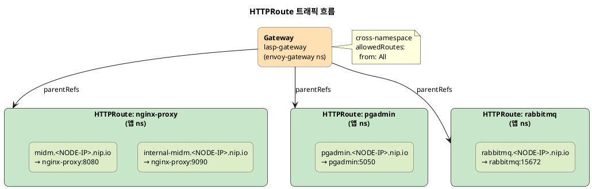

## HTTPRoute 설계 (앱별)



HTTPRoute는 **앱 네임스페이스에 배치**하고, `parentRefs`로 `envoy-gateway` 네임스페이스의 Gateway를 참조한다.

### nginx-proxy (Host 기반 라우팅)

```yaml
apiVersion: gateway.networking.k8s.io/v1
kind: HTTPRoute
metadata:
  name: nginx-proxy
spec:
  parentRefs:
    - name: lasp-gateway
      namespace: envoy-gateway
  hostnames:
    - "internal-midm.<NODE-IP>.nip.io"
    - "midm.<NODE-IP>.nip.io"
  rules:
    - matches:
        - headers:
            - name: Host
              value: internal-midm.<NODE-IP>.nip.io
      backendRefs:
        - name: nginx-proxy
          port: 9090
    - matches:
        - headers:
            - name: Host
              value: midm.<NODE-IP>.nip.io
      backendRefs:
        - name: nginx-proxy
          port: 8080
```

### pgadmin / rabbitmq

```yaml
# pgadmin
apiVersion: gateway.networking.k8s.io/v1
kind: HTTPRoute
metadata:
  name: pgadmin
spec:
  parentRefs:
    - name: lasp-gateway
      namespace: envoy-gateway
  hostnames:
    - "pgadmin.<NODE-IP>.nip.io"
  rules:
    - backendRefs:
        - name: pgadmin
          port: 5050
---
# rabbitmq
apiVersion: gateway.networking.k8s.io/v1
kind: HTTPRoute
metadata:
  name: rabbitmq
spec:
  parentRefs:
    - name: lasp-gateway
      namespace: envoy-gateway
  hostnames:
    - "rabbitmq.<NODE-IP>.nip.io"
  rules:
    - backendRefs:
        - name: rabbitmq
          port: 15672
```

### 전체 HTTPRoute 매핑

| HTTPRoute | 호스트명 | 백엔드 | 포트 |
|-----------|---------|--------|------|
| nginx-proxy | `internal-midm.<NODE-IP>.nip.io` | nginx-proxy | 9090 |
| nginx-proxy | `midm.<NODE-IP>.nip.io` | nginx-proxy | 8080 |
| pgadmin | `pgadmin.<NODE-IP>.nip.io` | pgadmin | 5050 |
| rabbitmq | `rabbitmq.<NODE-IP>.nip.io` | rabbitmq | 15672 |

**`nip.io`를 활용**하면 별도 DNS 설정 없이 IP 기반 호스트 라우팅을 테스트할 수 있다.

---

## NodePort·Service 패치 설계

### 왜 targetPort를 명시해야 하는가

Envoy 컨테이너는 **non-root**로 실행되는 경우가 많아, Service `port`(80/443)와 동일한 포트에 직접 바인딩하지 않을 수 있다. 실제 listen 포트는 xDS/버전에 따라 다르며, 반드시 Pod 내에서 `ss -tlnp` 등으로 확인해야 한다.

### NodePort 고정 예시

| 이름 | Service `port` | `nodePort` | `targetPort` |
|------|----------------|------------|--------------|
| http | 80 | 30080 | 10080 |
| https | 443 | 30443 | 10080 |

> HTTPS 리스너가 별도 포트(예: 10443)를 사용하는 환경이면 `https` 항목의 `targetPort`를 분리해야 한다.

### JSON Merge 패치 시 주의

EnvoyProxy CR의 `spec.ports` JSON Merge 패치에서 **`port`를 빠뜨리면** API 서버가 `port: 0`으로 처리할 수 있다. 두 포트가 모두 `0/TCP`로 겹치면서 다음 오류가 발생한다:

```
duplicate entries for key [port=0, protocol="TCP"]
```

**해결**: 각 항목에 `port`, `targetPort`, `nodePort`, `protocol`을 **모두 명시**한다.

---

## 배포 및 적용

### 적용 순서

1. **Envoy Gateway 컨트롤러** — Helm 렌더 + Kustomize 적용
2. **외부 리소스** — `GatewayClass` → `EnvoyProxy` → TLS Secret → `Gateway`
3. **HTTPRoute** — 각 앱 네임스페이스에 적용 (`parentRefs`가 Gateway를 참조)

### 네임스페이스 주의

- Gateway / EnvoyProxy / GatewayClass 참조는 `envoy-gateway` 기준
- `kubectl apply -f ... -n <다른-ns>` 를 주면 오브젝트의 namespace와 **불일치하여 실패**할 수 있다
- → `kubectl apply -k external/` 또는 `-n envoy-gateway`로 통일

### 검증 명령

```bash
# Gateway 상태
kubectl get gatewayclass,gateway -n envoy-gateway

# Envoy Proxy (데이터 플레인)
kubectl get svc -n envoy-gateway -l app.kubernetes.io/name=envoy
kubectl get ds  -n envoy-gateway -l app.kubernetes.io/component=proxy

# HTTPRoute (전체 네임스페이스)
kubectl get httproute -A

# Endpoints
kubectl get endpoints -n envoy-gateway
```

---

## 검증 및 테스트

### 정상 시나리오에서 확인한 것

DNS/LB가 NodePort(또는 그 앞단)로 트래픽을 보낼 때, **Envoy access log**에 요청이 기록된다.

로그에서 확인할 주요 필드:

| 필드 | 의미 |
|------|------|
| `:authority` | 요청 Host |
| `upstream_host` | 실제 프록시된 Pod IP:포트 |
| `response_code` | upstream 응답 코드 |
| `response_code_details` | `via_upstream` = upstream이 생성한 응답 (Envoy가 아님) |

### 부가 관찰 (nginx 프록시 경로)

다른 호스트가 nginx-proxy 등으로 연결된 경우, upstream에서 **301 리다이렉트**를 반환할 수 있다. 이 경우 `response_code_details: via_upstream`이며, LB/Envoy가 HTTPS인데 nginx가 HTTP로만 보면 `X-Forwarded-Proto` 등 설정을 nginx 측에서 맞출 필요가 있다.

### listen 주소 정리

| 구간 | 포트 |
|------|------|
| 클라이언트 → NodePort | 30080 (HTTP), 30443 (HTTPS) |
| Envoy Pod 내부 | targetPort 10080 (환경에 따라 변경 가능) |

> 반드시 `ss -tlnp` 등으로 실제 LISTEN 포트를 확인한 뒤 매니페스트를 조정한다.

---

## 정리

| 항목 | 결과 |
|------|------|
| Gateway API 기반 L7 라우팅 | ✅ HTTPRoute로 호스트·경로 라우팅 정상 동작 |
| cross-namespace 라우팅 | ✅ 앱 네임스페이스에서 Gateway 참조 가능 |
| NodePort 외부 노출 | ✅ 30080/30443 고정, LB/방화벽 연동 용이 |
| SecurityPolicy (IP 제어) | ✅ Gateway 레벨 선언적 접근 제어 |
| ClientTrafficPolicy | ✅ XFF 기반 클라이언트 IP 감지 |
| 기존 Ingress 공존 | ✅ 별도 스택으로 독립 운영 가능 |

Gateway API는 Ingress의 후속 표준으로, **선언적이고 구조화된** 라우팅 관리가 가능하다. Envoy Gateway는 그 구현체 중에서도 EnvoyProxy CR을 통한 **데이터 플레인 커스터마이징**이 강점이다. 기존 Ingress와 공존하면서 점진적으로 전환할 수 있다는 점이 실무에서 큰 장점이다.
