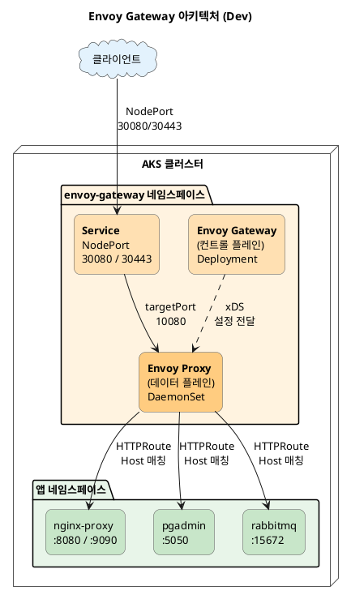

## 문서 정보

| 항목 | 내용 |
|------|------|
| 목적 | Dev 환경에 Envoy Gateway를 도입하고, Gateway API 기반 L7 라우팅 및 NodePort 외부 노출 검증 |
| 적용 환경 | AKS Dev 클러스터, 네임스페이스 `envoy-gateway` |
| 주요 버전 | Envoy Gateway v1.7.0, Envoy Proxy (distroless) |
| 관련 리포지토리 | `cluster-init` — 컨트롤 플레인 + Gateway CR, `lasp-gitops-deploy` — 앱별 HTTPRoute |

---

## 배경 및 목표

기존에는 **NGINX Ingress Controller**로 `Ingress` 리소스 기반 L7 라우팅을 사용하고 있었다. Envoy Gateway는 **Kubernetes Gateway API**(GatewayClass / Gateway / HTTPRoute)의 구현체로, 이번 작업은 **공존 및 검증** 목적이다.

### Envoy Gateway로 하려는 것

- **Gateway API 표준** 기반으로 호스트·경로 라우팅 선언 (HTTPRoute)
- 데이터 플레인을 **DaemonSet**으로 배치하여 특정 노드에 스케줄링
- 외부 진입은 **NodePort**(30080/30443)로 고정하여 LB/방화벽 연동을 쉽게 구성
- **SecurityPolicy**로 IP 화이트리스트 적용
- **ClientTrafficPolicy**로 클라이언트 IP 감지 및 연결 제어

### 이번 범위

| 포함 | 제외 |
|------|------|
| Dev `envoy-gateway` 네임스페이스 설치·설정 | PRD 동일 구성 전개 |
| GatewayClass + Gateway + EnvoyProxy + 정책 | 기존 Ingress 일괄 이관 |
| 앱 대상 HTTPRoute 테스트 (nginx-proxy, pgadmin, rabbitmq) | 전 서비스 Gateway API 전환 |
| SecurityPolicy (IP 화이트리스트) | cert-manager 연동, rate limiting |

---

## 아키텍처



### 컨트롤 플레인 vs 데이터 플레인

| 역할 | 설명 |
|------|------|
| **컨트롤 플레인** | `envoy-gateway` Deployment — Gateway/HTTPRoute를 읽고 xDS로 데이터 플레인에 설정 전달. 사용자 트래픽을 직접 받지 않음 |
| **데이터 플레인** | Gateway당 생성되는 Envoy DaemonSet — 실제 리스너에서 요청 수신 후 upstream으로 프록시 |

### 트래픽 흐름

```
클라이언트
  → (LB/VIP 또는 Node IP)
  → NodePort 30080/30443
  → Service (80/443)
  → Pod targetPort (Envoy listen 포트, 예: 10080)
  → HTTPRoute 매칭
  → Backend Service (예: nginx-proxy:8080)
```

### 사용 CRD

| CRD | 역할 |
|-----|------|
| `GatewayClass` | 컨트롤러 연결, `parametersRef`로 `EnvoyProxy` 참조 |
| `Gateway` | 리스너 정의 (HTTP 80, HTTPS 443 TLS Terminate) |
| `EnvoyProxy` | DaemonSet·Service(NodePort)·이미지 등 인프라 스펙 |
| `ClientTrafficPolicy` | X-Forwarded-For, HTTP/1.0, bufferLimit |
| `SecurityPolicy` | IP 화이트리스트 (CIDR 기반) |
| `HTTPRoute` | 호스트·규칙·backendRefs (앱 네임스페이스에 배치 가능) |

---

## 매니페스트

### GatewayClass

```yaml
kind: GatewayClass
apiVersion: gateway.networking.k8s.io/v1
metadata:
  name: lasp-gateway-class
spec:
  controllerName: gateway.envoyproxy.io/gatewayclass-controller
```

`parametersRef`로 `EnvoyProxy` CR을 연결하면 DaemonSet/NodePort 등 데이터 플레인 설정을 제어할 수 있다.

### Gateway

```yaml
apiVersion: gateway.networking.k8s.io/v1
kind: Gateway
metadata:
  name: lasp-gateway
spec:
  gatewayClassName: lasp-gateway-class
  listeners:
    - name: http
      protocol: HTTP
      port: 80
      allowedRoutes:
        namespaces:
          from: All
    - name: https
      protocol: HTTPS
      port: 443
      allowedRoutes:
        namespaces:
          from: All
      tls:
        mode: Terminate
        certificateRefs:
          - kind: Secret
            name: lasp-gateway-dummy-tls
```

**핵심 포인트:**
- `allowedRoutes.namespaces.from: All` — **cross-namespace** HTTPRoute 허용. 다른 네임스페이스의 앱이 이 Gateway를 parentRef로 참조 가능
- TLS: Dev 환경이므로 **self-signed dummy 시크릿** 사용. 운영 시 실제 인증서로 교체

### ClientTrafficPolicy

```yaml
apiVersion: gateway.envoyproxy.io/v1alpha1
kind: ClientTrafficPolicy
metadata:
  name: client-ip-detection
spec:
  targetRefs:
    - group: gateway.networking.k8s.io
      kind: Gateway
      name: lasp-gateway
  clientIPDetection:
    xForwardedFor:
      numTrustedHops: 1
  http1:
    http10: {}
  connection:
    bufferLimit: "1024Mi"
```

LB 뒤에서 실제 클라이언트 IP를 감지하려면 `numTrustedHops` 설정이 필수다.

### SecurityPolicy (IP 화이트리스트)

```yaml
apiVersion: gateway.envoyproxy.io/v1alpha1
kind: SecurityPolicy
metadata:
  name: ip-whitelist
spec:
  targetRefs:
    - group: gateway.networking.k8s.io
      kind: Gateway
      name: lasp-gateway
  authorization:
    defaultAction: Deny
    rules:
      - action: Allow
        principal:
          clientCIDRs:
            - 211.192.87.243/32
            - 211.192.87.209/32
```

Gateway 레벨에서 **IP 기반 접근 제어**를 선언적으로 적용할 수 있다. Ingress의 annotation 방식보다 구조적이다.

---

## Helm 배포 (Kustomize + HelmChart)

```yaml
# kustomization.yaml
namespace: envoy-gateway

resources:
- ./namespaces.yaml
- ./dummy-tls-secret.yaml
- ./lasp-gateway.yaml

helmGlobals:
  chartHome: ../../../base/envoy-gateway/charts

helmCharts:
- name: gateway-helm-v1.7.0
  version: v1.7.0
  releaseName: envoy-gateway
  namespace: envoy-gateway
  valuesFile: values.yaml
  includeCRDs: false
```

**CRD는 별도 관리** (`includeCRDs: false`) — CRD 업그레이드와 컨트롤러 업그레이드를 분리하기 위함.

### Helm values 주요 설정

| 항목 | 설정 |
|------|------|
| 이미지 | `envoyproxy/gateway:v1.7.0` |
| 리소스 | CPU 100m / Memory 256Mi~1024Mi |
| 보안 | non-root (UID 65532), seccompProfile RuntimeDefault |
| Service | ClusterIP (컨트롤 플레인), NodePort (데이터 플레인) |
| 레플리카 | 1 (Dev) |
| certgen | TTL 30s, non-root |
